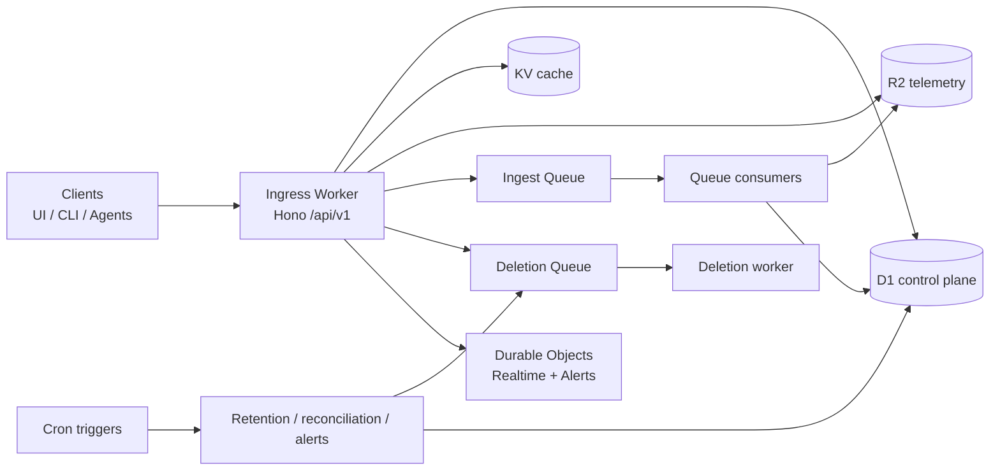
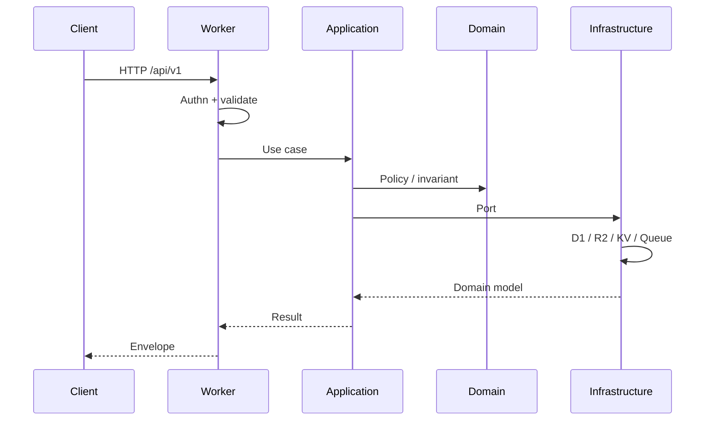

# Architecture

Open Edge is a Cloudflare-native observability backend. It provides logs, metrics, traces, APM, dashboards, alerts, retention, and deletion through a versioned REST API at `/api/v1`.

The backend is independent of any frontend. React, Vue, CLI tools, agents, and `curl` are equal API consumers. Clients never access D1, KV, R2, Queues, or Durable Objects.

## Dependency rule

```text
Presentation
     ↓
Application
     ↓
Domain
     ↑
Infrastructure
```

Domain never imports Hono, D1, KV, R2, Queue, Durable Objects, HTTP, or Cloudflare SDKs.

## System context



## Request path



## Storage split

| Store           | Role                                                                                                                                  |
| --------------- | ------------------------------------------------------------------------------------------------------------------------------------- |
| D1              | Identity, sessions, API keys, stream/series/trace indexes, chunk metadata, dashboards, alerts, retention, deletion jobs, audit, usage |
| R2              | Compressed log chunks, metric chunks, trace payloads                                                                                  |
| KV              | API-key metadata cache, tenant flags, query result cache, hot stream fingerprints                                                     |
| Cache API       | Read-heavy query responses, keyed by tenant + auth scope + query + range                                                              |
| Queues          | Ingestion and deletion (at-least-once)                                                                                                |
| Durable Objects | Per-tenant realtime fan-out and alert evaluation locks                                                                                |

D1 is never used as unlimited raw log storage.

## Bounded contexts

See [BOUNDED_CONTEXTS.md](BOUNDED_CONTEXTS.md). Contexts communicate through application orchestration and explicit domain events, not shared tables as a public API.

## Failure model

Cloudflare primitives do not provide distributed transactions. Every cross-store write uses an explicit state machine:

1. Write a `pending` control-plane row in D1.
2. Write the R2 object with a deterministic key.
3. Mark the row `ready`.
4. Cron reconciliation retries `pending` rows older than a grace period.

Queue delivery is at-least-once. Idempotency keys (`eventId`) are stored in `ingestion_dedup`.

## Cost posture

Hot path (ingest) does: 1 Worker invocation, 1 Queue publish, later 1 consumer batch, 1 R2 put, a small D1 batch. Query path uses D1 metadata to select chunks, then bounded R2 reads. See [COST.md](COST.md).

## Why this is not Loki/Prometheus/Tempo

Those systems assume long-lived processes, local disks, and cluster coordinators. Open Edge is request-scoped Workers plus Cloudflare storage. Chunking, query planning, and realtime are designed around object storage, SQLite metadata, and isolate CPU limits - not around a write-ahead log or TSDB on disk.
