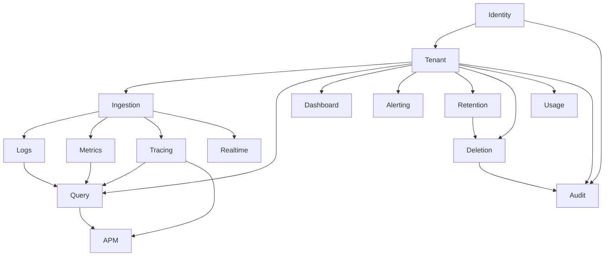

# Bounded contexts

Each context owns its model, invariants, and repository ports. Application services may orchestrate across contexts. Domain modules do not import infrastructure.

## Context map

| Context   | Responsibility                                                  | Owns                             | Does not own                          |
| --------- | --------------------------------------------------------------- | -------------------------------- | ------------------------------------- |
| Identity  | Users, passwords, sessions                                      | User, Session, credential hashes | Outbound email, billing               |
| Tenant    | Organization, membership, status, disable/delete workflow start | Tenant, Membership               | Telemetry bodies                      |
| Ingestion | Authz, validate, normalize, enqueue, consume, chunk, dedup      | IngestionEvent                   | Query language                        |
| Logs      | Streams, chunks, cardinality policy                             | LogStream, LogChunk, LogEntry    | Metrics/traces                        |
| Metrics   | Series, samples, histogram buckets                              | MetricSeries, MetricSample       | Logs                                  |
| Tracing   | Traces, spans, events, service edges                            | Trace, Span                      | APM rollups                           |
| Query     | Lexer → parser → AST → planner → executor                       | Query AST, plan, limits          | Storage layout                        |
| APM       | Throughput, latency, errors from traces                         | EndpointStats                    | Raw spans                             |
| Dashboard | Saved dashboard definitions                                     | Dashboard                        | Query execution                       |
| Alerting  | Rules, evaluation, fire/resolve                                 | Alert, AlertState                | Notification transport productization |
| Retention | Per-tenant TTL policy                                           | RetentionPolicy                  | Physical delete                       |
| Deletion  | Jobs, resume, R2+D1+KV cleanup                                  | DeletionJob                      | Policy values                         |
| Audit     | Security-sensitive event log                                    | AuditEvent                       | Secrets                               |
| Usage     | Operational ingest/query/storage counters                       | UsageRecord                      | Plans, invoices                       |
| Realtime  | Live tail, backpressure, limits                                 | Connection policy                | Persistence                           |

## Integration rules

- Tenant identity is taken only from authenticated session or API key. Client headers `X-Tenant-ID`, `X-User-ID`, and `X-Role` are ignored.
- Logs, metrics, and traces stay separate. Correlation is by `traceId`, `spanId`, `service`, and timestamp.
- APM never lives inside the Logs context.
- Query never writes telemetry.
