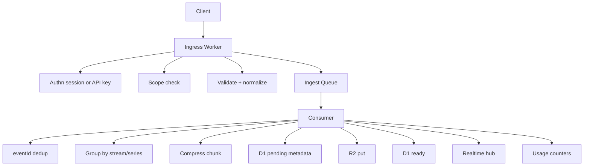

# Ingestion

Ingress never writes raw telemetry rows to D1.

## Event contract

Every event has `eventId` (client or server assigned UUID). Repeated Queue delivery hits `ingestion_dedup` and is dropped.

## Normalization

- Timestamps coerced to Unix milliseconds.
- Labels trimmed, lowercased keys, high-cardinality names rejected as stream identity.
- Line size capped at 16 KiB.
- Batch size capped at 500 events / 512 KiB.

## Queue semantics

At-least-once. Consumer retries use Queue retries (max 5) then DLQ `open-edge-ingest-dlq`. Partial batch: successful events are recorded in dedup so retries skip them. Poison messages after max retries land in the DLQ; they are not silently dropped.

## Idempotency

Deterministic chunk ids are derived from `tenantId + sorted eventIds`. Re-putting the same R2 key is safe.

## Realtime

After a chunk is `ready`, a compact notification is sent to the tenant-sharded Durable Object. The hub fans out matching lines to SSE subscribers with backpressure (drop-oldest per connection).
