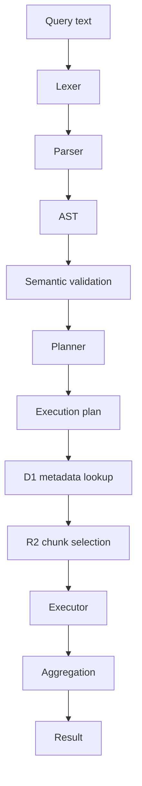

# Query engine

The query engine is its own bounded context. Every stage is independently testable.



## Log query language (LogQL-inspired)

```text
{service="api", environment="production"}
{service="api"} |= "error"
{service=~"api|worker"} | level = "error"
{service="api"} | json | level = "error"
count_over_time({service="api"} |= "error" [5m])
rate({service="api"} [1m])
```

Matchers: `=`, `!=`, `=~`, `!~`.  
Line filters: `|=` (contains), `|~` (regex).  
Structured filters: `| field = "value"`.  
Parser: `| json`.

Grammar is recursive-descent and left open for additional pipeline stages.

## Security limits (defaults)

| Limit                     | Value                                         |
| ------------------------- | --------------------------------------------- |
| Query length              | 4_096 chars                                   |
| Time range                | 30 days                                       |
| Result rows               | 5_000                                         |
| Streams per query         | 100                                           |
| Chunks per query          | 200                                           |
| Execution wall time       | 8_000 ms                                      |
| Regex                     | length ≤ 256, no nested unbounded quantifiers |
| Tenant concurrent queries | 4 (best-effort via KV lease)                  |

Exceeding a limit returns `QUERY_LIMIT_EXCEEDED` or `QUERY_TIMEOUT` without leaking internals.

## Planner

1. Parse matchers → fingerprint/label predicates.
2. Resolve streams from D1 (bounded).
3. Intersect chunk metadata with `[start, end]`.
4. Cap chunk count; refuse rather than scan everything.
5. Fetch selected R2 objects only.
6. Filter lines; aggregate if requested.

Never list all R2 objects for a tenant.

## Metrics query (PromQL subset)

```text
http_requests_total{service="api",env!="dev"}
rate(http_requests_total[5m])
increase(http_requests_total[1h])
avg_over_time(latency_ms[5m])
sum by (service) (rate(http_requests_total[5m]))
topk(5, rate(http_requests_total[5m]))
bottomk(3, avg_over_time(latency_ms[5m]))
histogram_quantile(0.95, http_request_duration_ms)
histogram_quantile(0.99, http_duration_bucket)
```

- `topk` / `bottomk`: rank series by last sample in the window (k = 1..100).
- `histogram_quantile(phi, ...)`: `phi ∈ (0,1)`. Uses per-sample `buckets` map, or classic `le` label series.

Pipeline: parse → series catalog → `metric_chunks.listInRange` → R2 gunzip NDJSON → step-aligned matrix.
Result: `{ resultType: "matrix", result: [{ metric, values }] }`.

## Traces

REST search (`service`, `operation`, `minDuration`, `status`, time range) plus `GET /traces/:traceId` for waterfall payloads.
