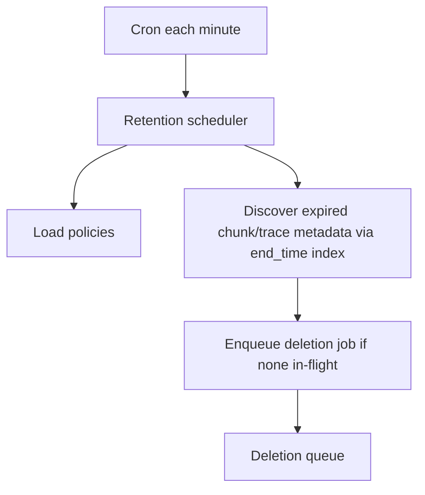

# Retention

Retention is a first-class policy, not a side effect of storage.

Allowed values: 7, 30, 90, 180, 365 days, or custom 1-730 days. Independently configurable for logs, metrics, and traces.

Discovery uses `idx_log_chunks_retention` / `idx_metric_chunks_retention` / `idx_traces_search`. It never lists the entire R2 bucket.

Default for a new tenant: 30 days for all three signals.
